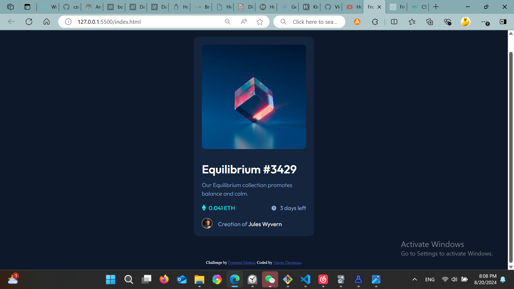

# Frontend Mentor - NFT preview card component solution

This is a solution to the [NFT preview card component challenge on Frontend Mentor](https://www.frontendmentor.io/challenges/nft-preview-card-component-SbdUL_w0U). Frontend Mentor challenges help you improve your coding skills by building realistic projects. 

## Table of contents

- [Overview](#overview)
  - [The challenge](#the-challenge)
  - [Screenshot](#screenshot)
  - [Links](#links)
- [My process](#my-process)
  - [Built with](#built-with)
  - [What I learned](#what-i-learned)
  - [Continued development](#continued-development)
  - [Useful resources](#useful-resources)
- [Author](#author)
- [Acknowledgments](#acknowledgments)

**Note: Delete this note and update the table of contents based on what sections you keep.**

## Overview

### The challenge

Users should be able to:

- View the optimal layout depending on their device's screen size
- See hover states for interactive elements

### Screenshot

### Links

- Solution URL: [The Solution URL](https://www.frontendmentor.io/solutions/nft-preview-card-component-my-solution-ixr8yat_cm)
- Live Site URL: [The live site](https://vincinchristmas.github.io/NFTPreviewCardComponenet/)

## My process
I just built this with pure html and floats.

### Built with

- Semantic HTML5 markup
- CSS custom properties

### What I learned
There was anything I have learned new in particular. This was just to keep my skills sharp and practice.

### Useful resources

- [Basic Shay Howe](https://learn.shayhowe.com/) - There is lots of information about potitioning and floats. I will use it going forward.

## Author

- Website - [Vincin Christmas](https://vincinchristmas.github.io/VincinChristmasPortfolio/)
- Frontend Mentor - [@VincinChristmas](https://www.frontendmentor.io/profile/VincinChristmas)
- Twitter - [@vineo666](https://x.com/vineo666)

**Note: Delete this note and add/remove/edit lines above based on what links you'd like to share.**

## Acknowledgments

Thank you front end mentor

**Note: Delete this note and edit this section's content as necessary. If you completed this challenge by yourself, feel free to delete this section entirely.**
